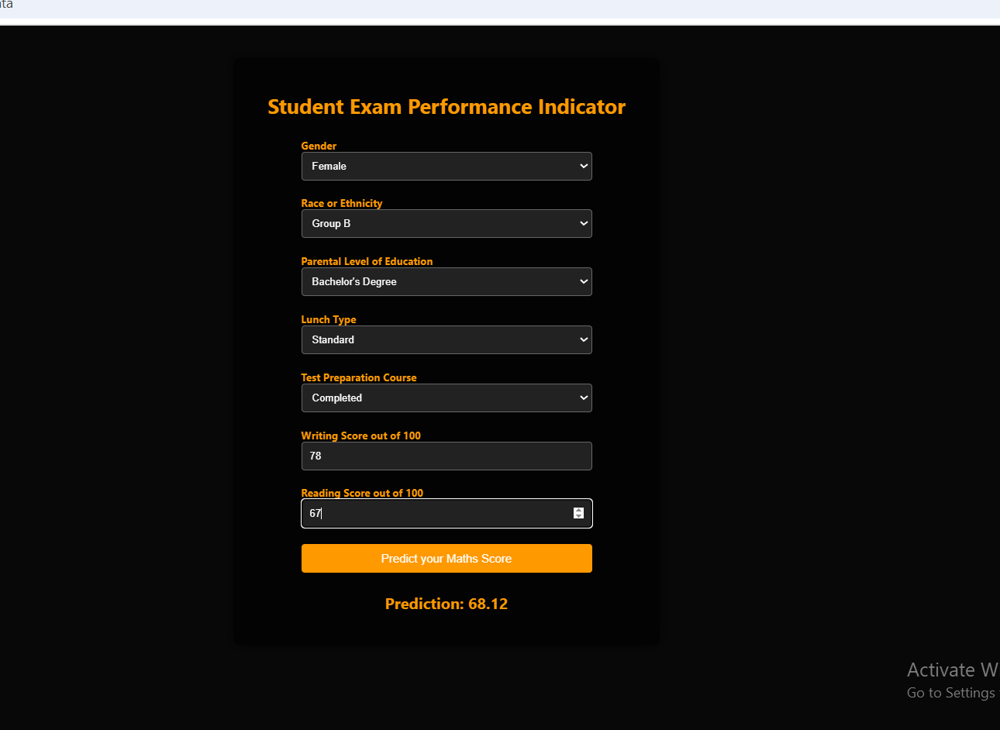

# 🌟 Student Performance Prediction 📚🎓

## 📊 Overview
Welcome to the **Student Performance Prediction** project! 🚀 This project focuses on predicting students' math scores based on various factors such as:

- **👦 Gender**
- **🌍 Race/Ethnicity**
- **🎓 Parental Level of Education**
- **🍽️ Lunch Type**
- **📚 Test Preparation Course**

By analyzing these parameters, we aim to identify key influences on academic performance and develop a predictive model that can help educators understand and enhance student outcomes. ✨

## 🗃️ Dataset
The dataset used for this project contains the following features:

- **👨‍🎓 Gender**: Gender of the student (e.g., male, female)
- **🌈 Race/Ethnicity**: Ethnic background of the student (e.g., group A, group B, etc.)
- **🎓 Parental Level of Education**: Highest level of education attained by the parents (e.g., high school, associate's degree, etc.)
- **🍽️ Lunch**: Type of lunch received (e.g., standard, free/reduced)
- **📚 Test Preparation Course**: Whether the student completed a test preparation course (e.g., completed, none)
- **📐 Math Score**: Score obtained in the math subject (🎯 **Target Variable**)
- **📖 Reading Score**: Score obtained in the reading subject
- **✍️ Writing Score**: Score obtained in the writing subject

### 🔍 Data Description
The dataset is structured as a **CSV** file, making it easy to manipulate and analyze using popular data analysis libraries like **Pandas** and **NumPy** in Python. 📈

## 🎯 Objectives
- 📈 **Analyze** the correlation between various factors and math scores.
- 🤖 **Build** a predictive model to estimate math scores based on input features.
- 📊 **Visualize** data relationships and trends for better understanding and presentation.


## 🖼️ Student Interface Preview
Here is a snapshot of the project interface:



*Figure: Sample UI showing student data input and predicted performance.*


## 🚀 How to Use
1. **Clone the repository**:
   ```bash
   git clone https://github.com/Shalini-Nanda-ds/Student-s_Performance.git

## 🎉 Conclusion
This project aims to provide insights into student performance and help identify factors that significantly impact math scores. By understanding these influences, educators can take proactive steps to support students in their academic journeys. 🌈✨
